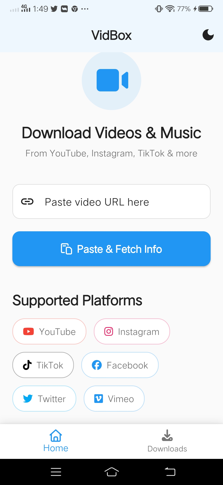
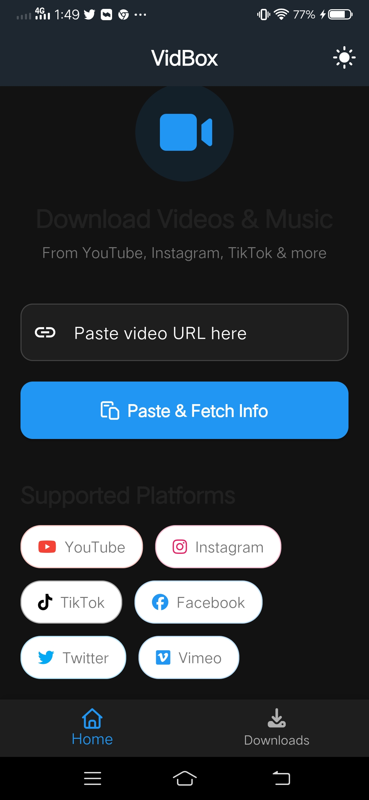
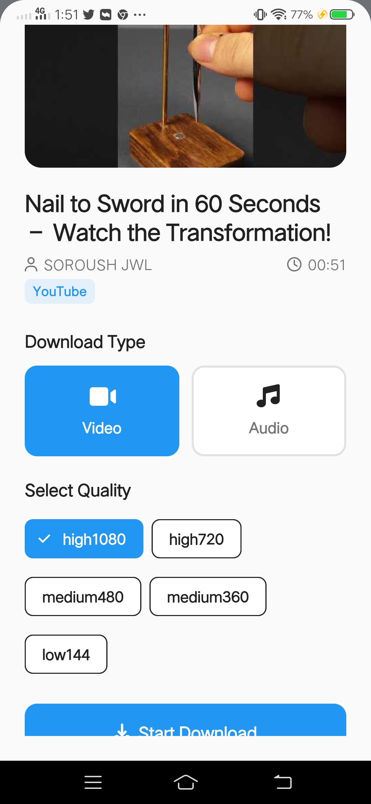
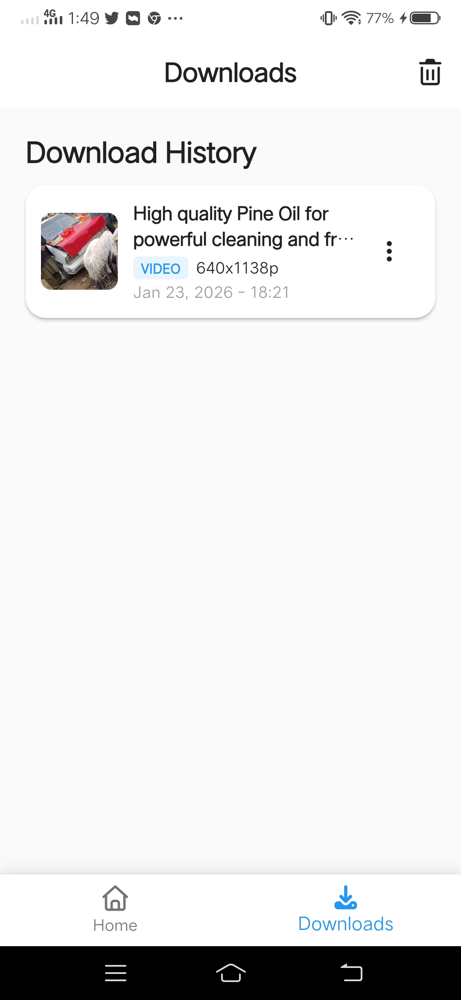
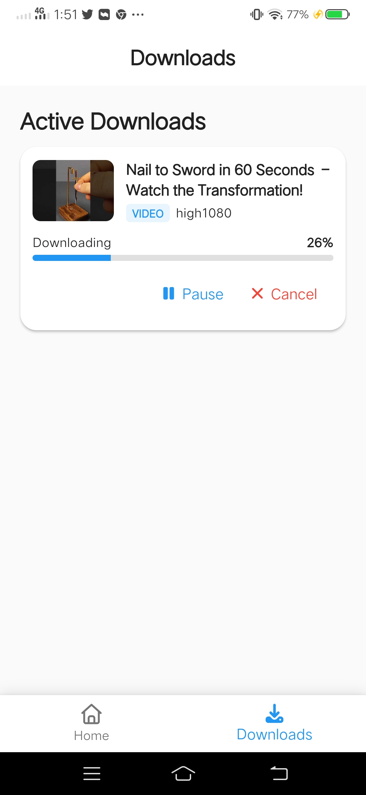

# 📦 VidBox — Video & Audio Downloader

A professional **Flutter (Android)** app for downloading videos and audio from popular social media platforms. Paste a link, pick your quality, and download — with real-time progress, notifications, and in-app playback.

---

## 📱 App Overview

VidBox is a full-featured download manager for social media content. Users paste a URL from any supported platform, the app fetches video metadata, and they can choose to download the full video or just the audio at their preferred quality. All downloads are tracked via a Supabase backend and saved to a dedicated folder on the device.

- **YouTube** — powered by `youtube_explode_dart`
- **Instagram, TikTok, Facebook, Twitter/X, Vimeo** — powered by **RapidAPI**

---
>   
>   
>   
>   
>   


## ✨ Features

### 🎬 Downloading
- Paste any supported URL and fetch video info with one tap
- Choose between **Video** or **Audio** download
- Select from multiple quality options (up to 4K video / 320kbps audio)
- Real-time download progress tracking
- Download queue management
- Pause, resume, and cancel active downloads
- Retry failed downloads
- Duplicate detection (won't re-download the same file)

### 📋 Download History
- View all past and active downloads in one screen
- Delete entries from history
- Play downloaded media directly from the app

### 🔔 System Integration
- System notifications for download progress and completion
- Files saved to `{Storage}/VidBox Downloads/` on the device
- Supports Android 13+ media permissions

### 🎨 UI & UX
- Material Design 3 interface
- Dark Mode support
- Responsive and clean layout

---

## 🌐 Supported Platforms

| Platform     | Method                    | Status |
|--------------|---------------------------|--------|
| YouTube      | youtube_explode_dart       | ✅ Fully working |
| Instagram    | RapidAPI                  | ✅ Fully working |
| TikTok       | RapidAPI                  | ✅ Fully working |
| Facebook     | RapidAPI                  | ✅ Fully working |
| Twitter / X  | RapidAPI                  | ✅ Fully working |
| Vimeo        | RapidAPI                  | ✅ Fully working |

---

## 🎚️ Quality Options

**Video:** 2160p (4K), 1440p (2K), 1080p, 720p, 480p, 360p

**Audio:** 320kbps, 256kbps, 192kbps, 128kbps

---

## 🛠️ Tech Stack

| Technology | Purpose |
|---|---|
| Flutter (Android) | UI framework |
| Dart | Programming language |
| GetX | State management & routing |
| Supabase | Backend database (download history) |
| RapidAPI | Video extraction for Instagram, TikTok, Facebook, Twitter, Vimeo |
| youtube_explode_dart | YouTube video extraction |
| dio | Network requests & file downloading |
| flutter_local_notifications | Download progress notifications |
| video_player | In-app video playback |
| just_audio | In-app audio playback |
| permission_handler | Runtime permission management |
| cached_network_image | Thumbnail caching |

---

## 📁 Project Structure

```
lib/
├── core/
│   ├── routes/                       # App navigation
│   ├── services/
│   │   ├── database_service.dart         # Supabase operations
│   │   ├── download_service.dart         # Download queue & management
│   │   ├── notification_service.dart     # System notifications
│   │   ├── permission_service.dart       # Runtime permissions
│   │   ├── storage_service.dart          # File storage management
│   │   └── video_info_service.dart       # URL parsing & metadata fetch
│   ├── theme/                        # App theming & dark mode
│   └── utils/                        # Constants & helpers
├── data/
│   └── models/                       # Data models (download, video info)
├── modules/
│   ├── home/                         # Home screen (URL input & fetch)
│   ├── downloads/                    # Downloads list & history
│   └── main/                         # Bottom nav / main scaffold
└── main.dart
```

---

## 🚀 Getting Started

### Prerequisites

- [Flutter SDK](https://docs.flutter.dev/get-started/install) ≥ 3.0.0
- Android Studio
- A [Supabase](https://supabase.com) account and project
- A [RapidAPI](https://rapidapi.com) account and API key

### 1. Clone the Repository

```bash
git clone https://github.com/Abd-ul-Hannan/Abd-ul-Hannan-VidBox.git
cd Abd-ul-Hannan-VidBox
```

### 2. Install Dependencies

```bash
flutter pub get
```

### 3. Set Up Supabase

Create a table in your Supabase project by running this SQL:

```sql
CREATE TABLE downloads (
  id TEXT PRIMARY KEY,
  url TEXT NOT NULL,
  title TEXT NOT NULL,
  thumbnail TEXT,
  type TEXT NOT NULL,
  quality TEXT NOT NULL,
  status TEXT NOT NULL,
  progress INTEGER DEFAULT 0,
  file_path TEXT,
  platform TEXT NOT NULL,
  created_at TIMESTAMPTZ DEFAULT NOW(),
  updated_at TIMESTAMPTZ DEFAULT NOW()
);

ALTER TABLE downloads ENABLE ROW LEVEL SECURITY;

CREATE POLICY "Allow all operations"
  ON downloads FOR ALL TO anon
  USING (true) WITH CHECK (true);
```

### 4. Configure Environment Variables

Copy the example env file:

```bash
cp .env.example .env
```

Then fill in your credentials in `.env`:

```env
SUPABASE_URL=your_supabase_project_url
SUPABASE_ANON_KEY=your_supabase_anon_key
RAPIDAPI_KEY=your_rapidapi_key
```

### 5. Run the App

```bash
flutter run -d android
```

---

## 📖 How to Use

### Downloading a Video or Audio
1. Open the app and go to the **Home** tab
2. Paste a supported URL (YouTube, Instagram, TikTok, Facebook, Twitter, or Vimeo)
3. Tap **"Paste & Fetch Info"** — the app loads the video title and thumbnail
4. Choose **Video** or **Audio**
5. Select your preferred quality
6. Tap **"Start Download"**

### Managing Downloads
- Go to the **Downloads** tab to see all active and completed downloads
- **Pause** / **Resume** / **Cancel** active downloads using the action buttons
- **Retry** failed downloads with one tap
- **Play** any completed file directly inside the app
- **Delete** entries from history using the menu

---

## 🔐 Permissions Required

| Permission | Reason |
|---|---|
| Internet | Fetching video info and downloading files |
| Storage (Read/Write) | Saving downloaded files to device |
| Notifications | Download progress and completion alerts |
| Media Library (Android 13+) | Accessing media files on newer Android versions |

All permissions are requested automatically on first launch.

---

## 📦 Building for Release (Android)

1. **Generate a keystore**
   ```bash
   keytool -genkey -v -keystore ~/vidbox-key.jks -keyalg RSA -keysize 2048 -validity 10000 -alias vidbox
   ```

2. **Create `android/key.properties`**
   ```
   storePassword=<your-password>
   keyPassword=<your-password>
   keyAlias=vidbox
   storeFile=<path-to-keystore>
   ```

3. **Build APK or App Bundle**
   ```bash
   flutter build apk --release
   flutter build appbundle --release
   ```

---

## 🔧 Troubleshooting

**Download fails?**
- Check your internet connection
- Make sure your RapidAPI key is valid and has quota remaining
- Verify the URL is from a supported platform
- Check available device storage

**Permission denied?**
- Go to Settings → Apps → VidBox → Permissions and enable all required permissions

**Video won't play?**
- Confirm the file exists in `{Storage}/VidBox Downloads/`
- Check if the file download completed successfully (no errors in history)

---

## 📋 Requirements

- Flutter SDK: `>=3.0.0 <4.0.0`
- Android: API level 21 (Android 5.0) or higher

---

## 🚀 Planned Features

- Batch / playlist download support
- Download scheduler
- Subtitle download
- Cloud storage integration
- iOS support

---

## ⚖️ Disclaimer

This project is for educational purposes only. Always respect copyright laws and the terms of service of the platforms you download from. Use responsibly.

---

## 📄 License

This project is open source. See the [LICENSE](LICENSE) file for details.

---

## 👤 Author

**Abd-ul-Hannan**  
GitHub: [@Abd-ul-Hannan](https://github.com/Abd-ul-Hannan)

---

> Built with ❤️ using Flutter
